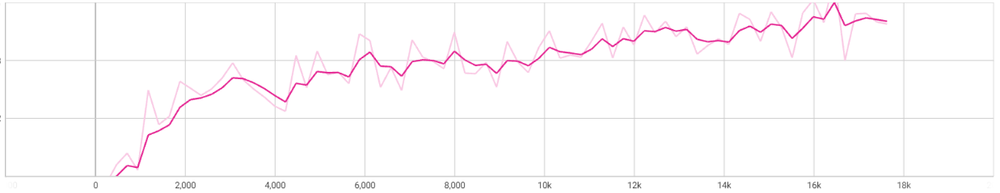
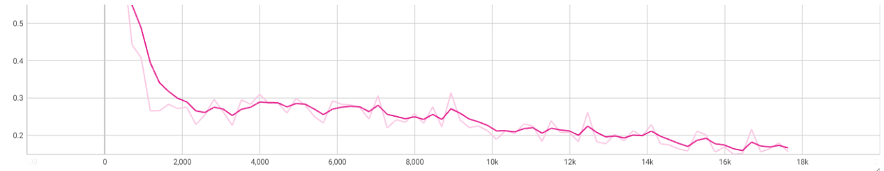

# GAN-MINIST

This is a simple implementation of a Generative Adversarial Network (GAN) to generate handwritten digits from the MNIST dataset. The GAN is implemented in PyTorch.

I just implemented the training loop and the generator and discriminator networks. By running the training loop, you could know the basic idea of how GAN works.

## About the Loss

In the training process, I noticed that the loss of the generator are growing up slowly. I think it is because the discriminator is too strong. 

- loss of generator: 
    

- loss of discriminator:
    

But in the global view, the generator and discriminator are balanced. And the output image is good.

